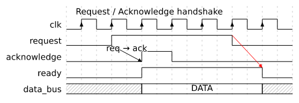
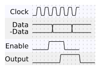
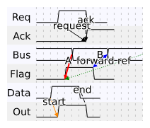
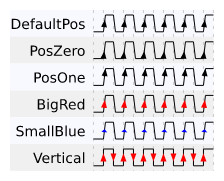

# tchart-rust

English | [日本語](README.ja.md)

This project is an independent Rust implementation that draws on [the original tchart](https://www.mech.tohoku-gakuin.ac.jp/rde/contents/library/tchart/indexframe.html) (Tohoku Gakuin University) and [tchart-coffee](https://dora.bk.tsukuba.ac.jp/~takeuchi/) (University of Tsukuba). See [Acknowledgements](#acknowledgements).

**A small tool for sketching digital timing charts** (clock / data / bus / control waveforms) from a short text description. Useful for digital circuit / FPGA / HDL work, design notes, and quick "what does this waveform look like?" sketches in discussions.

You write a chart in TCML (Timing Chart Markup Language):

```
@title Request / Acknowledge handshake
@slant 0

@clock(pos)
clk

request      ___@{r}~~~~~~~~@1____
acknowledge  _____@{a}~~________
ready        _____~~~~~~~~@2__
data_bus     =?====X==DATA=====X?=

@-> (@{r}, @{a}) req → ack
@-> (@1, @2, red)
```

and `tchart` renders it as:



Try it in your browser: <https://nodamushi.github.io/tchart-rust/>

Also distributed as a single CLI binary (Linux / Windows) and a single self-contained offline HTML editor. No Node.js / runtime / installer required.

## Features

The syntax-level differences from the predecessors are deliberately small. The notable additions / improvements are:

- **Auto-sized signal name column.** Signal names of any length are laid out automatically; no width hints or hand-padded spaces are required.
- **Cross-signal arrows (`@->`).** Mark positions in waveforms with `@{name}` (or short numeric anchors like `@1`), then draw arrows between them with optional colour, line style, arrow head, and label. Useful for showing causal or timing relationships across signals.
- **`@clock` auto-expansion.** Declare a clock as a single line; the body is generated automatically, with positive / negative / both / no edge markers.
- **WaveDrom export.** `tchart wavedrom` converts the same TCML into [WaveJSON](https://github.com/wavedrom/schema/blob/master/WaveJSON.md), so a rough sketch in TCML can be handed off to [`wavedrom-cli`](https://wavedrom.com/) for datasheet-quality rendering. (Lossy: WaveDrom does not model every TCML feature.)

## More samples





Source TCML: [`docs/images/sample.tc`](docs/images/sample.tc) / [`docs/images/arrow.tc`](docs/images/arrow.tc) / [`docs/images/clock_marks.tc`](docs/images/clock_marks.tc)

## Quick start

### CLI

Grab the latest binary from [Releases](https://github.com/nodamushi/tchart-rust/releases).

#### Linux (x86_64)

```bash
VER=v0.1.0
curl -fsSLO https://github.com/nodamushi/tchart-rust/releases/download/$VER/tchart-$VER-x86_64-unknown-linux-gnu.tar.gz
tar -xzf tchart-$VER-x86_64-unknown-linux-gnu.tar.gz
cd tchart-$VER-x86_64-unknown-linux-gnu
./tchart svg chart.tc
./tchart png chart.tc
```

#### Windows (x86_64)

Download `tchart-v0.1.0-x86_64-pc-windows-msvc.zip` from the [Releases](https://github.com/nodamushi/tchart-rust/releases) page, extract it, then:

```powershell
.\tchart.exe svg chart.tc
.\tchart.exe png chart.tc
```

#### Usage

```
tchart svg      <INPUT>                          # render TCML to SVG
tchart png      <INPUT>                          # render TCML to PNG
tchart src      <SVG_OR_PNG>                     # extract embedded TCML
tchart wavedrom <INPUT>                          # convert TCML to WaveDrom JSON
tchart batch    <svg|png> <INPUT>... -o <DIR>    # process multiple files
```

Examples:

```bash
tchart svg chart.tc                    # → chart.svg next to input
tchart png chart.tc -o out.png         # explicit output path
tchart svg chart.tc --font-size 14     # custom font size
tchart src chart.png -o -              # extract embedded TCML to stdout
tchart batch svg samples/*.tc -o out/  # batch convert
```

Common options:

| Flag | Description | Default |
|---|---|---|
| `-o, --output <PATH>` | Output file (for `batch`, output directory) | next to input |
| `--font <FILE>` | Default font file | system font auto-detect |
| `--font-size <SIZE>` | Font size in px (> 0) | `12.0` |
| `-h, --help` | Help | |

For building from source, see [`tchart-cli/README.md`](tchart-cli/README.md).

### Web editor

- Editor: <https://nodamushi.github.io/tchart-rust/>
- Help (English): <https://nodamushi.github.io/tchart-rust/help/tcml-format.en.html>
- Help (Japanese): <https://nodamushi.github.io/tchart-rust/help/tcml-format.html>

Browser "Save as…" on the editor URL gives you a single HTML file that runs offline (CSS / JS / wasm / help are all inlined).

### WASM library

```typescript
import init, { render_tcml } from './tchart-web/pkg/tchart_web.js';
await init();
const svg = render_tcml("Clock _~_~_~");
```

## Documentation

The detailed spec documents under `docs/spec/` are currently Japanese only.
For the TCML syntax reference, the hosted help is available in both languages:

- TCML format reference (English): <https://nodamushi.github.io/tchart-rust/help/tcml-format.en.html>
- TCML format reference (Japanese): <https://nodamushi.github.io/tchart-rust/help/tcml-format.html>

Internal spec documents (Japanese):

- [TCML format](docs/spec/tcml-format.md)
- [CLI](docs/spec/cli.md)
- [Web (WASM)](docs/spec/web.md)
- [Web editor](docs/spec/editor.md)
- [WaveDrom export](docs/spec/wavedrom.md)

## Acknowledgements

Deep thanks to the authors of the following prior work:

- [Original tchart](https://www.mech.tohoku-gakuin.ac.jp/rde/contents/library/tchart/indexframe.html) (Tohoku Gakuin University)
- [tchart-coffee](https://dora.bk.tsukuba.ac.jp/~takeuchi/?%E3%82%BD%E3%83%95%E3%83%88%E3%82%A6%E3%82%A7%E3%82%A2%2F%E3%82%BF%E3%82%A4%E3%83%9F%E3%83%B3%E3%82%B0%E3%83%81%E3%83%A3%E3%83%BC%E3%83%88%E6%B8%85%E6%9B%B8%E3%82%B5%E3%83%BC%E3%83%93%E3%82%B9) (University of Tsukuba)

## See also

- [WaveDrom](https://wavedrom.com/) — for high-quality, datasheet-grade timing diagrams
